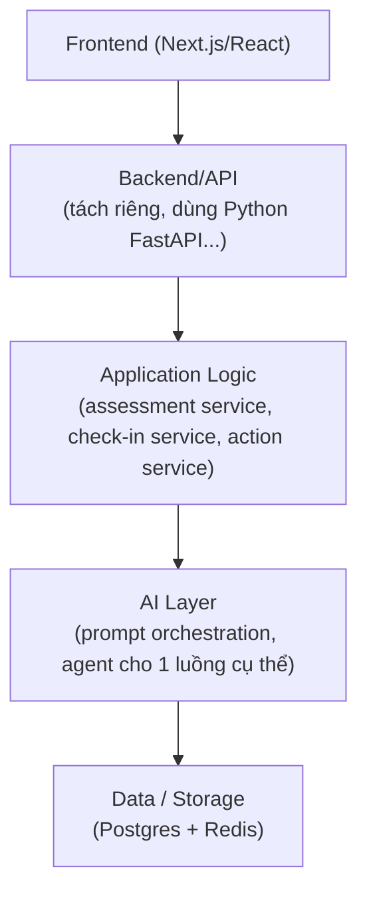

# Assessment 02: Product & Technical Reasoning Case

---

## Task A — Product Prioritization (3 features tiếp theo)

### 1. Document upload

- **User problem:** User hiện phải nhập tay tất cả các field, nếu dùng document, có thể tái sử dụng, cấu trúc rõ ràng hơn trong document.
- **Expected value:** AI có context thật từ tài liệu, hỗ trợ các dạng tài liệu cơ bản trước ở phase 1 (docs, sheet, csv, pdf, markdown, html, jpg, png).
- **Technical complexity:** Trung bình/cao, cần upload storage (S3/blob), text extraction (PDF/docx parser, có thể OCR cho bản scan), chunking nội dung dài trước khi đưa vào prompt, giới hạn file size/type, và cần RAG để context trả về được chính xác hơn, tránh halluciation.
- **Why now:** Tính năng cơ bản đối với hầu hết các platform AI hiện tại, cần thiết để tăng khả năng cạnh tranh, và dễ dàng mở rộng các features mới cần context nhiều (như Feature #2 flashcard/quiz/plan).
- **Deliberately postpone:** hỗ trợ tải lên file/ảnh song song với cách nhập text như hiện nay.

### 2. Flashcard + Quiz + Learning Plan + Tracking

- **User problem:** Do hiện tại đã có short-term cho học sinh rồi, nên cần có những hành động cụ thể mà học sinh có thể tiếp tục sử dụng sản phẩm, nhưng không quá khó để bắt đầu.
- **Expected value:** Biến short-term từ chỉ là text thành 1 learning journey có cấu trúc (roadmap kiểu roadmap.sh) + tracking tiến độ (như duolingo).
- **Technical complexity:** Cao, cần data model cho plan (milestones/steps), liên kết flashcard/quiz với từng step, tracking trạng thái hoàn thành mỗi step, logic AI sinh roadmap từ document + cập nhật roadmap khi user tiến bộ/lệch tiến độ.
- **Why now:** Giúp thay vì trợ lý học hoặc là chatbot thì trở thành người đồng hành và theo dõi tiến độ.
- **Deliberately postpone:** Spaced repetition scheduling (tương tự Anki), custom theo learning style của học sinh, làm plan tuyến tính từ cơ bản đến nâng cao.

### 3. Share workspace

- **User problem:** Giúp tăng tính cộng đồng, cạnh tranh giữa các học sinh, tài liệu đóng góp được đa dạng.
- **Expected value:** Tăng tương tác và cạnh tranh giữa các học sinh (nhiều student cùng thấy tiến độ nhau), mở rộng khách hàng cá nhân sang group/workspace.
- **Technical complexity:** Cao, cần khái niệm workspace/group tách khỏi user (nhiều user trỏ vào 1 plan/document chung), quyền truy cập (owner/member), đồng bộ tracking khi nhiều người cùng dùng, UI hiển thị tiến độ nhóm.
- **Why now:** Phụ thuộc vào feature #2 đã có plan/tracking ổn định — làm workspace share sớm hơn sẽ phải build lại phần collaborative-state 2 lần.
- **Deliberately postpone:** share resourse trong 1 workspace/group, phân quyền cho user, có admin, subadmin (tránh quá nhiều role ở giai đoạn đầu), chưa cần realtim edit.

---

## Task B — Architecture (MVP mở rộng)

### 1. Frontend

Responsibility:

- Upload tài liệu, hiển thị flashcard/quiz, hiển thị roadmap/plan (timeline dạng roadmap.sh)
- Tracking dashboard (% hoàn thành mỗi step)
- Trang workspace (list member + tiến độ nhóm).
- Không chứa business logic — chỉ gọi API và render.

### 2. Backend

Tách ra dùng 1 framework API riêng vì mở rộng phức tạp cần setup agent, tool và pipeline, không gộp chung nextjs như hiện tại

### 3. AI Layer

- LLM được gọi tập trung qua 1 module (không rải rác gọi trực tiếp từ nhiều chỗ) — để dễ đổi provider, thêm retry/fallback/logging ở 1 điểm.
- Chuẩn bị cho luồng pipeline nhiều bước thay vì 1 lần gọi: extract document → sinh plan/roadmap → sinh flashcard/quiz cho từng step → khi tracking cập nhật, có thể cần re-plan step tiếp theo.
- Cần agent và tool-calling để có thể extract document, tạo plan async

### 4. Data

- `users` — id, email, created_at
- `documents` — id, user_id, filename, storage_ref, status
  (processing/ready/failed), created_at
- `flashcards` — id, plan_step_id, question, answer, created_at
- `quizzes` — id, plan_step_id, questions (JSON), created_at
- `plans` — id, workspace_id, source_document_id, title, created_at
- `plan_steps` — id, plan_id, title, order, status
  (not_started/in_progress/done)
- `workspaces` — id, name, owner_id, created_at
- `workspace_members` — id, workspace_id, user_id, role (owner/member),
  joined_at

Postgres phù hợp vì dữ liệu có quan hệ rõ ràng (workspace → plan → plan_steps → flashcards/quizzes; workspace → members). Nội dung document gốc (text dài) lưu ở object storage (S3), Postgres chỉ giữ `storage_ref`, tránh row quá lớn và tách rời phần content khỏi phần transactional data.

### 5. Validation

- Schema validation (Zod) ở API layer cho cả input lẫn AI output — kế thừa nguyên tắc từ Test 1: không tin tưởng response chỉ vì HTTP 200.
- Validate file upload: giới hạn size, chỉ nhận định dạng đã hỗ trợ, reject trước khi call API.
- Guardrail nội dung: check output không chứa gợi ý có hại/không phù hợp (blocklist từ khóa cơ bản, có thể gọi 1 api để check nếu nghi ngờ).
- Human review sample định kỳ (xem Task C) để bắt lỗi mà validation tự động không phát hiện được (sai về nội dung, không phải sai format).

---

## Task C — AI Reliability (4 mechanisms)

1. **Schema validation (Zod)** mọi output AI phải khớp schema trước khi tới user; sai schema → reject, không render ra UI (đã áp dụng ở Test 1).
2. **Retry có giới hạn** network/5xx lỗi tạm thời thì retry 1 lần; lỗi schema thì không retry.
3. **Fallback response** nếu AI fail liên tục (network down, quá tải), trả 1 message rõ ràng "hiện chưa thể phân tích, thử lại sau", không giả câu trả lời của AI nếu fail.
4. **Human review sample** định kỳ (vd: 10-20 response ngẫu nhiên/tuần) có người xem qua output thật để bắt pattern hallucination/gợi ý không phù hợp mà validation tự động không thấy được — đầu vào cho việc chỉnh prompt.
5. **Prompt versioning** có thể rollback lại prompt cũ nếu prompt mới không ổn định, tạo 1 template cho prompt theo prompt best practice

---

## Task D — Scaling (100 → 10,000 → 100,000 users)

### 1. LLM API rate limit & cost

- **Vì sao xảy ra:** Mỗi lần user gọi LLM. Nếu 100k user, mỗi user gọi API 1 lần/tuần → hơn 10 nghìn request/ngày, có thể chạm rate limit của provider hoặc chi phí tăng phi tuyến.
- **Phát hiện bằng cách nào:** Theo dõi cost-per-request và request volume theo thời gian thực (dashboard); alert khi gần ngưỡng rate limit.
- **Giải quyết:** Cache prompt template (không rebuild mỗi lần), batch khi có thể, dùng model rẻ nếu task không cần reasoning, và có thể cần queue (không gọi đồng bộ trực tiếp từ request) để điều tiết lưu lượng.

### 2. DB connection pool nghẽn ở giờ cao điểm

- **Vì sao xảy ra:** Concurrent users dồn vào cùng khung giờ (ví dụ notification gửi cùng lúc buổi tối hoặc user đăng nhập vào ngày nghỉ nhiều) → spike connection tới Postgres.
- **Phát hiện bằng cách nào:** Metric connection pool usage, query latency tăng đột biến.
- **Giải quyết:** Connection pooling (PgBouncer), rải giờ gửi notification (jitter thay vì gửi đồng loạt), đọc dữ liệu không critical qua replica.

### 3. AI response latency ảnh hưởng UX

- **Vì sao xảy ra:** Gọi LLM đồng bộ trong request, user phải chờ full round-trip; ở scale lớn, latency trung bình tăng do queue phía provider hoặc do prompt phức tạp hơn (hoặc có task dùng nhiều context).
- **Phát hiện bằng cách nào:** Theo dõi latency của endpoint llm, so với baseline lúc 100 user.
- **Giải quyết:** Streaming response (user thấy tiến độ thay vì màn hình trắng), chuyển các task nặng sang mô hình async (submit → xử lý ở background → notify khi xong).

---

## Task E — Product × Engineering Trade-off (launch trong 7 ngày)

- Ví dụ: có 2 feature, feature A làm nhanh hơn nhưng độ quan trọng thấp hơn feature B, nhưng feature B sẽ cần refactor ở X, và refactor có thể dẫn đến nhiều rủi ro nhưng có thể hardcode để launch feature B trước.

**Communication:** Trình bày cụ thể risk, không nói chung chung "sẽ có technical debt". Nói rõ có technical dept là cần hardcode.

**Decision:** Đề xuất cắt giảm scope cho feature B (B version 1) và sẽ có tech dept, sau đó update dần (commulative update)

**Implementation:** Build đúng phần đã cam kết trong phạm vi đã thống nhất, không tự ý mở rộng thêm hoặc tự ý cắt mà không báo lại.

**Follow-up:** Tạo ticket cụ thể cho debt ngay khi launch xong, cho vào sprint kế tiếp (hoặc backlogs).

---

## Task F — Measurement (metrics)

### Product Metrics

- **Feature adoption** % user dùng feature mới trong 30 ngày (đo feature có đáng công sức đã bỏ ra không)
- **Check-in completion rate** % user hoàn thành progress
- **Retention (W1/W4)** — % user tạo bài học mới

### AI Metrics

- **Validation pass rate** — % response AI pass Zod schema ngay lần đầu (đo chất lượng prompt/model)
- **Hallucination/error rate** — % sample bị reviewer đánh dấu sai/lệch (đo chất lượng nội dung, việc validation tự động không bắt được)

### Technical Metrics

- **Latency** — thời gian từ submit tới có kết quả (đo UX thực tế)
- **API error rate** — % request lỗi 5xx/502/422 (đo độ ổn định hệ thống)

### Cost

- **Cost per request** — chi phí LLM trung bình mỗi lần call (đo unit economics, cảnh báo sớm trước khi cost vượt kiểm soát ở scale lớn)

Chọn nhóm metric này vì trả lời: Product có ai dùng không, AI chất lượng ra sao, technical có ổn định không, cost có tối ưu trên mỗi task không.

---

## Task G — Ownership (30 ngày đầu)

### Week 1 — Understand

Đọc code hiện có, gặp stakeholder (product, các dev khác), hiểu rõ constraint thật. Học workflow hiện tại của team, tự document lại về product (tech, PRD, context, ...)

### Week 2 — Prioritize

Fix bugs, feature nhỏ.

### Week 3 — Build

Ship các bugs và features đã làm được ở tuần 2, nhận review, feadback.

### Week 4 — Validate & Improve

Cải thiện và lên plan cho chu kỳ tiếp theo.
